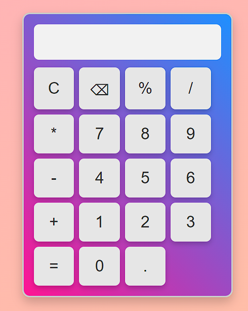

# Calculadora

## Descrição
A Calculadora é um projeto desenvolvido em HTML, CSS e JavaScript que oferece funcionalidades básicas de uma calculadora simples. Este projeto foi criado como parte do meu aprendizado em desenvolvimento web.

## Funcionalidades Principais
- Operações básicas de adição, subtração, multiplicação e divisão.
- Capacidade de realizar cálculos com números decimais.
- Botão de limpar para reiniciar a calculadora.
- Interface simples e intuitiva.

## Tecnologias Utilizadas
- HTML5
- CSS3
- JavaScript

## Como Utilizar
1. Clone o repositório (`git clone https://github.com/AngeloHervis/Calculadora.git`).
2. Abra o arquivo `index.html` em seu navegador web.
3. Use os botões da calculadora para realizar cálculos.

## Autor
Angelo Hervis
- GitHub: [AngeloHervis](https://github.com/AngeloHervis)
- LinkedIn: [Angelo Hervis](https://www.linkedin.com/in/angelohervis/)

